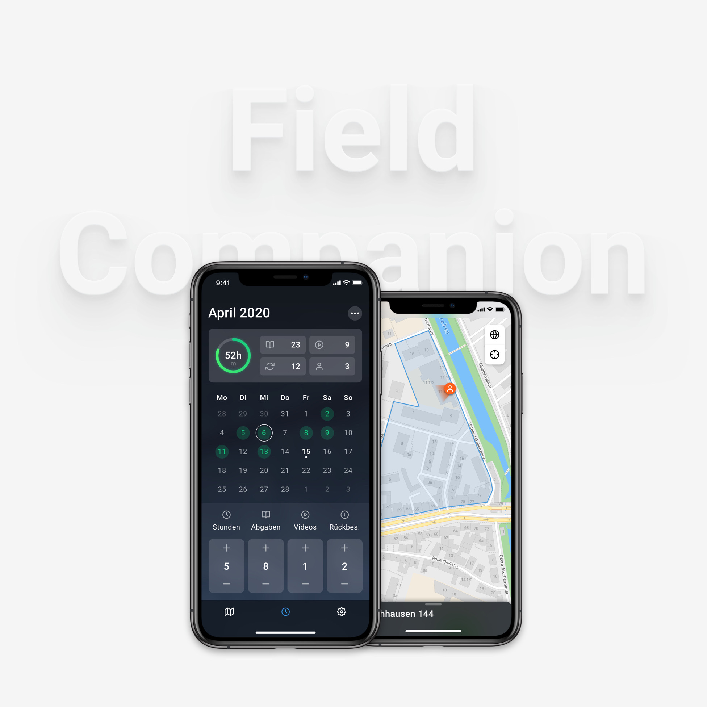

# Field Companion

## Setup

### Install dependencies
`flutter pub get`

### Install lefthook

You need to manually install lefthook in your specific environment.

And then run: `lefthook install`

### Run app
`flutter run`

## Features
### Set goals for yourself

With FieldCompanion, you can set hourly targets for each month and the whole year and constantly track your progress.

### Report your service

The monthly view shows you what you have reported for each day and gives you the possibility to add new reports and edit previous ones at any time.

### Send your monthly report

At the end of the month, everything is automatically added up and made available to you as a report that you can simply send.

### Your territories - always there

If your territory servant uses Territory Offline, they can send you your territory so that you can import it into Field Companion. This allows you to view your territories on the map at any time and manage non-visiting addresses.

https://www.territory-offline.com/